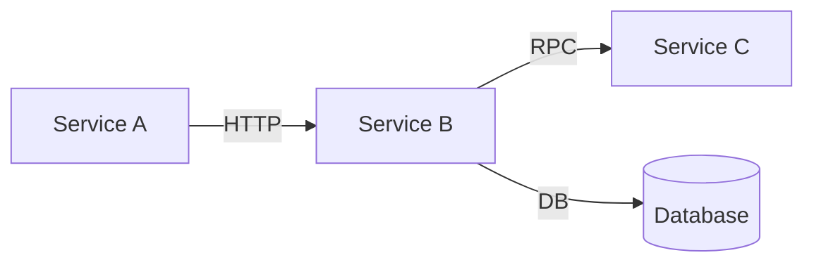

# SkyWalking Trace Agent

Fetch SkyWalking traces, locate related source code, and generate analysis reports or detailed design documents.

## Commands

### Fetch and analyze traces

```
/sw-trace <trace_ids> [--name <name>] [--no-analyze] [--no-locate] [--no-csv]
```

### Fetch and generate detailed design document

```
/sw-trace <trace_ids> --name <name> --design
```

**Arguments:**
- `trace_ids` — One or more SkyWalking trace IDs (space or comma separated)

**Options:**
- `--name, -n` — Output folder name under `.trace/` (default: `trace-<timestamp>`)
- `--repo, -r` — Repo name (default: last used repo)
- `--no-analyze` — Skip automatic analysis
- `--no-locate` — Skip code location
- `--no-csv` — Skip CSV export
- `--design` — Generate detailed design document (全链路详细设计文档)

**Examples:**
```
/sw-trace abc123.1.123 --name login-bug
/sw-trace id1 id2 id3 --name order-flow
/sw-trace id1 --name payment --design
```

### Configure

```
/sw-trace config
```

Interactively configure a repo.

### Reset

```
/sw-trace reset
```

Clear all repos and configurations, start fresh.

### Help

```
/sw-trace help
```

## Repo 概念

所有配置按 repo（工程）隔离，存储在 `~/.claude/sw-trace/repos/<name>/config.yaml`。

- 每个 repo 独立保存 SkyWalking 地址、代码仓库路径等配置
- 自动记住上次使用的 repo，下次默认使用
- 可通过 `--repo` 指定使用其他 repo
- `/sw-trace reset` 清空所有 repo

## Workflow — Interactive Selection (no trace_id)

When the user invokes `/sw-trace` WITHOUT providing any trace IDs:

1. **Determine repo** — If `--repo` is specified, use it. Otherwise read the last used repo from `~/.claude/sw-trace/repos/.current`.

2. **Load config** — Read `~/.claude/sw-trace/repos/<name>/config.yaml`.

3. **Fetch recent traces** — Execute the CLI list command (queries last 60 minutes by default):
   ```bash
   node ~/.claude/skills/sw-trace/dist/index.js list --limit 30 [--repo <name>]
   ```
   The command outputs JSON trace summary list to stdout. Diagnostic messages go to stderr.

4. **Present trace selection** — Parse the JSON output. Convert `startTime` (epoch millis string) to local time for display. Use `AskUserQuestion` (multiSelect: true) to let the user pick traces:
   - **Header**: "Traces"
   - **Label format**: `[{HH:mm:ss}] {duration}ms {endpointName} {isError ? "❌" : "✓"}`
   - **Description format**: `TraceID: {traceId}`
   - **If the list is empty**, tell the user exactly what the CLI reported (time range and limit used, shown on stderr). Offer these options:
     - "Retry with 24h range" — re-run: `node ~/.claude/skills/sw-trace/dist/index.js list --minutes 1440 --limit 30`
     - "Provide trace IDs manually" — user pastes trace IDs from SkyWalking UI
     - "Check OAP connectivity" — verify the OAP URL from config

5. **Choose output name** — Use `AskUserQuestion` to let the user pick a name:
   - `trace-<timestamp>` (Recommended)
   - Name by endpoint (use the first selected trace's endpoint name)
   - Other — allow free-text input

6. **Choose mode** — Use `AskUserQuestion` to let the user pick the analysis mode:
   - **analysis** — Standard analysis report (errors, slow calls, DB calls, CSV export)
   - **design** — Detailed design document (全链路详细设计文档)

7. **Execute** — With the selected trace_ids, name, and mode, proceed to the corresponding workflow:
   - **analysis** → Standard Analysis Mode, start from step 5 (the full deep analysis flow, steps 5-13)
   - **design** → Design Document Mode, start from step 1

## Workflow — Standard Analysis Mode

When the user invokes `/sw-trace <trace_ids>` (without `--design`):

1. **Determine repo** — If `--repo` is specified, use it. Otherwise read the last used repo from `~/.claude/sw-trace/repos/.current`. Display: `Repo: <name>`

2. **Load config** — Read `~/.claude/sw-trace/repos/<name>/config.yaml`. Note the configured `codebases` paths and types — these are the source code repositories you will read from during analysis.

3. **Check prompt override** — If `prompt_override` is set in config and the file exists, use it to augment this skill's instructions. Otherwise use the default instructions below.

4. **Parse arguments** — Extract trace IDs and options from the user's input.

5. **Execute the sw-trace CLI tool:**
   ```bash
   node ~/.claude/skills/sw-trace/dist/index.js <trace_ids> --name <name> --cwd <current_project_dir> [--repo <name>] [--no-analyze] [--no-locate] [--no-csv] [--design]
   ```

6. **Read all generated data** — Load every output file into context:
   - **Raw trace data** — Read EVERY `raw/*.json` file. Each contains the full span tree with per-span: `serviceCode`, `endpointName`, `startTime`, `endTime`, `isError`, `layer`, `component`, `tags` (key-value pairs like `db.statement`, `db.type`, `http.method`, `http.params`, `class.name`, `method.name`), `logs` (timed log entries with key-value data like `error.kind`, `message`, `stack`), `refs` (cross-segment references).
   - **Code locations** — Read `locations.json`. Maps each span (segmentId:spanId) to one or more source file locations with `file`, `line`, `method`, `confidence`.
   - **CLI analysis** — Read `analysis.md` (the auto-generated report from the CLI).
   - **CSV** — Read `*.csv` for the hierarchical tree view of the full call chain.

7. **Error deep analysis** — For EVERY error span (isError: true) found in the raw data:
   - **Extract error details from span logs:** Look for `error.kind` (exception class), `message` (error message), `stack` (stack trace) in the span's `logs[].data[]` array.
   - **Locate source code:** Find the span's key in `locations.json`. If a match exists, read the source file from the configured codebase path. Focus on the identified method.
   - **Read surrounding context:** Read at least 20-30 lines around the error location to understand the full method logic, try-catch blocks, and upstream calls that may contribute to the error.
   - **Root cause analysis:** Determine WHY the error occurred:
     - Is it a code defect (null pointer, index out of bounds, incorrect parameter)?
     - Is it an external dependency failure (DB connection, HTTP timeout, RPC error)?
     - Is it a data anomaly (unexpected input, missing data, format error)?
     - Does the exception propagate from a downstream service? If so, trace to the root.
   - **Write findings** with: error location (`file:line`), method name, exception type and message, relevant source code snippet, root cause explanation, and concrete fix suggestion.

8. **Performance deep analysis:**
   - **Identify slow calls:** Calculate duration (`endTime - startTime`) for every span. Flag spans exceeding 1000ms.
   - **Read source for each slow call:** For each slow span with a code location, read the source method. Analyze WHY it's slow:
     - N+1 queries (repeated DB calls in a loop)?
     - Synchronous blocking I/O (file read, HTTP call, socket)?
     - Large data processing (big loops, memory pressure)?
     - Lock contention (synchronized blocks, database locks)?
     - Missing cache (repeated computation)?
   - **Database call analysis:** For spans with `layer: "Database"` or `db.type` tag:
     - Extract the SQL statement from `db.statement` tag.
     - Note the DB instance from `db.instance` tag or `peer`.
     - Check for: full table scans (SELECT * without LIMIT, no WHERE clause), missing indexes (JOIN without indexed columns), large result sets.
   - **Duration breakdown:** Calculate what percentage of total trace time is spent in:
     - Database calls (layer: Database)
     - RPC/HTTP calls (layer: RPCFramework or component: HTTP)
     - Business logic (remaining time)
     - List the top 5 slowest individual operations.

9. **Exception propagation analysis** (if errors exist):
   - Trace the parent-child chain from each error span to the root entry span.
   - Identify which span is the ROOT CAUSE vs cascading failures.
   - Build a propagation path: `Entry → Service A → Service B (ERROR ROOT) → Service C (cascaded error)`.
   - Note if error handling (try-catch, fallback, retry) is present anywhere in the chain.

10. **Write deep analysis report** — Overwrite `.trace/<name>/analysis.md` with a comprehensive report:

```markdown
# 深度分析报告：[入口端点名]

## 1. 概览

| 项目 | 值 |
|------|-----|
| Trace ID | xxx |
| 入口端点 | GET /api/xxx |
| 总耗时 | xxx ms |
| Span 总数 | xx |
| 涉及服务 | svc-a, svc-b |

**摘要：** [一句话描述这次调用链的整体情况]

---

## 2. 错误分析

> 如果无错误，写"本次调用链无错误"，跳过本节。

对每个错误 span，按以下格式输出：

### 2.1 [服务名] — [端点/组件名]

| 属性 | 值 |
|------|-----|
| **位置** | `path/to/File.java:123` (`methodName`) |
| **耗时** | xxx ms |
| **异常类型** | java.lang.XxxException |
| **异常消息** | Something went wrong... |

**源码上下文：**
```java
// 贴出关键代码片段（10-30 行）
```

**根因分析：**
[解释为什么会出错：代码逻辑、外部依赖、数据问题等]

**修复建议：**
[具体的修复方案，包含代码示例]

**堆栈信息（如有）：**
```
// 从 span logs 中提取的 stack
```

---

## 3. 性能分析

### 3.1 慢调用 Top N

| 排名 | 耗时(ms) | 服务 | 方法/端点 | 代码位置 | 类型 | 问题分析 |
|------|---------|------|----------|---------|------|---------|
| 1 | 5000 | svc-a | getOrder | File.java:45 | DB | N+1 查询 |
| 2 | 3000 | svc-b | calcFee | Fee.java:89 | Logic | 大循环未分页 |

### 3.2 耗时分布

```
总耗时: xxx ms
├── DB 调用:   xx ms (xx%)   ← N 次数据库查询
├── RPC 调用:  xx ms (xx%)   ← M 次远程调用
└── 业务逻辑:  xx ms (xx%)   ← 推断值
```

### 3.3 慢 SQL 分析

| 耗时(ms) | 数据库 | SQL 语句 | 调用位置 | 问题 | 索引建议 |
|----------|--------|---------|---------|------|---------|
| 2000 | mydb | SELECT * FROM orders WHERE ... | OrderDao.java:30 | 全表扫描 | idx_orders_xxx |

---

## 4. 调用链分析

### 4.1 服务调用关系

```
Entry (nginx) → order-service (GET /api/orders)
  ├── DB: SELECT * FROM orders (200ms)
  ├── payment-service (POST /api/pay) (1500ms)
  │   ├── DB: INSERT INTO payments (100ms)
  │   └── DB: UPDATE orders SET status (50ms)
  └── DB: UPDATE orders SET status (30ms)
```

### 4.2 异常传播路径（如有）

```
Entry → order-service → payment-service (ERROR ROOT: DbConnectionException)
                                    → order-service (cascaded: ServiceUnavailableException)
```

---

## 5. 总结与建议

### 关键发现
1. **[优先级：高/中/低]** [发现内容]
2. ...

### 修复建议清单
| 优先级 | 问题 | 修复方案 | 涉及文件 |
|--------|------|---------|---------|
| 高 | xxx | xxx | File.java:123 |

### 需进一步排查
- [ ] [需要更多信息才能确认的问题]
```

11. **Present conversation summary** — Show a compact summary to the user:
    - Total traces analyzed, total spans, total errors, total slow calls
    - List each error with location and brief cause
    - List top 3 slow calls with duration and location
    - If errors exist, flag the root cause span(s)

12. **Print output paths** — List all generated file paths and the output directory.

13. **Offer next steps** — Ask the user if they want to:
    - Read specific source files identified in the analysis in more detail
    - Dive deeper into a specific error's root cause
    - Compare multiple traces for patterns

## Workflow — Design Document Mode (--design)

When the user invokes `/sw-trace <trace_ids> --design --name <name>`:

1. **Execute standard fetch** — Run the CLI tool with `--design` flag to fetch traces, locate code, and generate analysis data.

2. **Read all generated data:**
   - `raw/*.json` — All trace span data
   - `locations.json` — Code location results
   - `analysis.md` — Analysis report
   - Read the actual source files referenced in `locations.json` to understand implementation details

3. **Generate detailed design document** — Write `.trace/<name>/design.md` containing the following sections, conforming to standard detailed design document (详细设计文档) specifications:

### design.md 文档结构

```
# 详细设计文档：[名称]

## 1. 概述
- 文档目的
- 涉及的系统/服务列表
- trace 覆盖的完整链路概述

## 2. 全链路流程图 (Mermaid Flowchart)
- 从入口请求到最终响应的完整调用流程
- 每个节点标注：服务名、接口路径、组件类型
- 标注错误节点和慢调用节点（红色/黄色标记）
- 跨服务调用用虚线箭头表示

## 3. 时序图 (Mermaid Sequence Diagram)
- 按时间顺序展示各服务间的交互
- 标注每个调用的耗时
- 标注数据库操作（与 DB 的交互单独标出）
- 标注错误和异常

## 4. 状态图 (Mermaid State Diagram)
- 关键业务对象的状态流转
- 根据代码和 trace 推断状态机
- 如果没有明确的状态流转，说明并跳过

## 5. 接口设计
### 5.1 接口列表
列出链路中涉及的所有接口：

| 序号 | 服务 | 接口路径 | 方法 | 说明 |
|------|------|----------|------|------|

### 5.2 接口详细定义
对每个接口，根据源码和 trace 数据生成：

#### POST /api/xxx
- **所属服务：** xxx
- **Controller：** XxxController.java:123
- **入参：** 根据 @RequestBody / @RequestParam 注解从源码中提取参数定义
  ```json
  { "field1": "string", "field2": "integer" }
  ```
- **出参：** 根据返回值类型从源码中提取
  ```json
  { "code": 0, "data": { ... }, "message": "success" }
  ```
- **调用链路：** 该接口内部调用的服务和方法

## 6. 数据库设计
### 6.1 涉及的数据库表
从 trace 中的 DB span 提取，汇总为：

| 序号 | 数据库实例 | 表名 | 操作类型 | SQL 示例 | 调用位置 |
|------|-----------|------|---------|---------|---------|

### 6.2 SQL 语句详情
列出 trace 中捕获到的完整 SQL 语句，按调用顺序排列

## 7. 服务间调用关系
用 Mermaid 图展示服务依赖关系：



## 8. 性能分析
- 调用耗时分布（各服务/各层的耗时占比）
- 慢调用明细
- 潜在性能瓶颈

## 9. 异常分析（如有）
- 错误 span 详情
- 异常传播链路
- 根因分析

## 附录
- Trace ID 列表
- 分析数据生成时间
- 配置的服务列表
```

4. **Mermaid diagram guidelines:**
   - Use `flowchart TD` for call flow
   - Use `sequenceDiagram` for time-ordered interactions
   - Use `stateDiagram-v2` for state transitions
   - Use `graph LR` for service dependency
   - Mark error nodes with `style fill:#ff6b6b` and slow nodes with `style fill:#ffd93d`
   - Keep diagrams readable — split into sub-diagrams if a single diagram has > 15 nodes

5. **Source code reading strategy:**
   - For each code location in `locations.json`, read the source file
   - Focus on: controller/handler methods, service layer logic, DAO/repository calls
   - Extract parameter types from annotations (@RequestBody, @RequestParam, @PathVariable)
   - Extract return types from method signatures
   - Extract SQL from MyBatis XML mappers or JPA @Query annotations if files exist nearby

6. **Print output paths** — After generating `design.md`, list all generated files.

## Workflow — Config

When the user invokes `/sw-trace config`:

1. **List existing repos** — Read `~/.claude/sw-trace/repos/` and show available repos.
2. **Ask the user:**
   - Select an existing repo to edit, or create a new one (use AskUserQuestion)
3. **If creating new:** Ask for repo name.
4. **Configure the repo:**
   - SkyWalking OAP host (default: 127.0.0.1)
   - Port (default: 12800)
   - Protocol (default: http)
   - Code repositories — for each:
     - Name (identifier)
     - Path (absolute path to the project)
     - Type (springboot / springmvc / ejb / generic)
     - Source roots (e.g., src/main/java)
   - Ask if they want to add more repositories
5. **Save** — Write to `~/.claude/sw-trace/repos/<name>/config.yaml` and update `.current`

## Workflow — Reset

When the user invokes `/sw-trace reset`:

1. Confirm with the user: "This will delete all repos and configurations. Are you sure?"
2. If confirmed, run `node ~/.claude/skills/sw-trace/dist/index.js reset`
3. Guide the user to run `/sw-trace config` to create a new repo

## Configuration File Format

Per-repo config at `~/.claude/sw-trace/repos/<name>/config.yaml`:

```yaml
skywalking:
  host: "127.0.0.1"
  port: 12800
  protocol: "http"
  timeout: 30

codebases:
  - name: "my-service"
    path: "/path/to/project"
    type: "springboot"        # springboot | springmvc | ejb | generic
    source_roots:
      - "src/main/java"

output:
  directory: ".trace"

# Optional: external prompt override file
# prompt_override: "/path/to/custom-prompt.md"
```

## Output Directory Structure

### Standard mode:
```
.trace/<name>/
├── meta.json              # Fetch metadata (trace IDs, timestamp, OAP URL, repo)
├── raw/
│   ├── <trace_id>.json    # Raw span data from OAP
│   └── ...
├── <trace_id>.csv         # Hierarchical CSV (one per trace)
├── locations.json         # Code location results
└── analysis.md            # Analysis report
```

### Design mode (--design):
```
.trace/<name>/
├── meta.json
├── raw/
│   └── <trace_id>.json
├── <trace_id>.csv
├── locations.json
├── analysis.md
└── design.md              # Detailed design document
```

## Default Instructions

When no prompt override is configured, follow these instructions:

- Always fetch ALL specified trace IDs in a single invocation
- Always run analysis unless `--no-analyze` is specified
- Always attempt code location unless `--no-locate` is specified or no codebases are configured
- Read and present the analysis.md content after generation
- Highlight actionable findings (errors, slow calls > 1s, shared slow code across traces)
- **Always print the full list of generated file paths at the end**
- In design mode, read source code files to generate accurate interface definitions (input/output params)
