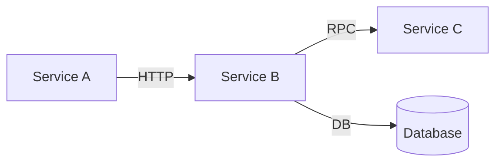

# SkyWalking Trace Agent

Fetch SkyWalking traces, locate related source code, and generate analysis reports or detailed design documents.

## Commands

### Fetch and analyze traces

```
/sw-trace <trace_ids> [--name <name>] [--no-analyze] [--no-locate] [--no-csv]
```

### Fetch and generate detailed design document

```
/sw-trace <trace_ids> --name <name> --design
```

**Arguments:**
- `trace_ids` — One or more SkyWalking trace IDs (space or comma separated)

**Options:**
- `--name, -n` — Output folder name under `.trace/` (default: `trace-<timestamp>`)
- `--repo, -r` — Repo name (default: last used repo)
- `--no-analyze` — Skip automatic analysis
- `--no-locate` — Skip code location
- `--no-csv` — Skip CSV export
- `--design` — Generate detailed design document (全链路详细设计文档)

**Examples:**
```
/sw-trace abc123.1.123 --name login-bug
/sw-trace id1 id2 id3 --name order-flow
/sw-trace id1 --name payment --design
```

### Configure

```
/sw-trace config
```

Interactively configure a repo.

### Reset

```
/sw-trace reset
```

Clear all repos and configurations, start fresh.

### Help

```
/sw-trace help
```

## Repo 概念

所有配置按 repo（工程）隔离，存储在 `~/.claude/sw-trace/repos/<name>/config.yaml`。

- 每个 repo 独立保存 SkyWalking 地址、代码仓库路径等配置
- 自动记住上次使用的 repo，下次默认使用
- 可通过 `--repo` 指定使用其他 repo
- `/sw-trace reset` 清空所有 repo

## Workflow — Standard Analysis Mode

When the user invokes `/sw-trace <trace_ids>` (without `--design`):

1. **Determine repo** — If `--repo` is specified, use it. Otherwise read the last used repo from `~/.claude/sw-trace/repos/.current`. Display: `Repo: <name>`

2. **Load config** — Read `~/.claude/sw-trace/repos/<name>/config.yaml`

3. **Check prompt override** — If `prompt_override` is set in config and the file exists, use it to augment this skill's instructions. Otherwise use the default instructions below.

4. **Parse arguments** — Extract trace IDs and options from the user's input.

5. **Execute the sw-trace CLI tool:**
   ```bash
   node ~/.claude/skills/sw-trace/dist/index.js <trace_ids> --name <name> --cwd <current_project_dir> [--repo <name>] [--no-analyze] [--no-locate] [--no-csv] [--design]
   ```

6. **Review the output** — Read the generated files from `.trace/<name>/`:
   - `meta.json` — Fetch metadata
   - `raw/*.json` — Raw trace data
   - `*.csv` — Hierarchical CSV files
   - `locations.json` — Code location results
   - `analysis.md` — Analysis report

7. **Present results** — Show the conversation summary to the user. If errors or slow calls were found, highlight them with file:line references.

8. **Print output paths** — List all generated file paths and the output directory.

9. **Offer next steps** — Ask the user if they want to:
   - Read specific source files identified in the analysis
   - Dive deeper into a specific error or slow call
   - Compare traces

## Workflow — Design Document Mode (--design)

When the user invokes `/sw-trace <trace_ids> --design --name <name>`:

1. **Execute standard fetch** — Run the CLI tool with `--design` flag to fetch traces, locate code, and generate analysis data.

2. **Read all generated data:**
   - `raw/*.json` — All trace span data
   - `locations.json` — Code location results
   - `analysis.md` — Analysis report
   - Read the actual source files referenced in `locations.json` to understand implementation details

3. **Generate detailed design document** — Write `.trace/<name>/design.md` containing the following sections, conforming to standard detailed design document (详细设计文档) specifications:

### design.md 文档结构

```
# 详细设计文档：[名称]

## 1. 概述
- 文档目的
- 涉及的系统/服务列表
- trace 覆盖的完整链路概述

## 2. 全链路流程图 (Mermaid Flowchart)
- 从入口请求到最终响应的完整调用流程
- 每个节点标注：服务名、接口路径、组件类型
- 标注错误节点和慢调用节点（红色/黄色标记）
- 跨服务调用用虚线箭头表示

## 3. 时序图 (Mermaid Sequence Diagram)
- 按时间顺序展示各服务间的交互
- 标注每个调用的耗时
- 标注数据库操作（与 DB 的交互单独标出）
- 标注错误和异常

## 4. 状态图 (Mermaid State Diagram)
- 关键业务对象的状态流转
- 根据代码和 trace 推断状态机
- 如果没有明确的状态流转，说明并跳过

## 5. 接口设计
### 5.1 接口列表
列出链路中涉及的所有接口：

| 序号 | 服务 | 接口路径 | 方法 | 说明 |
|------|------|----------|------|------|

### 5.2 接口详细定义
对每个接口，根据源码和 trace 数据生成：

#### POST /api/xxx
- **所属服务：** xxx
- **Controller：** XxxController.java:123
- **入参：** 根据 @RequestBody / @RequestParam 注解从源码中提取参数定义
  ```json
  { "field1": "string", "field2": "integer" }
  ```
- **出参：** 根据返回值类型从源码中提取
  ```json
  { "code": 0, "data": { ... }, "message": "success" }
  ```
- **调用链路：** 该接口内部调用的服务和方法

## 6. 数据库设计
### 6.1 涉及的数据库表
从 trace 中的 DB span 提取，汇总为：

| 序号 | 数据库实例 | 表名 | 操作类型 | SQL 示例 | 调用位置 |
|------|-----------|------|---------|---------|---------|

### 6.2 SQL 语句详情
列出 trace 中捕获到的完整 SQL 语句，按调用顺序排列

## 7. 服务间调用关系
用 Mermaid 图展示服务依赖关系：



## 8. 性能分析
- 调用耗时分布（各服务/各层的耗时占比）
- 慢调用明细
- 潜在性能瓶颈

## 9. 异常分析（如有）
- 错误 span 详情
- 异常传播链路
- 根因分析

## 附录
- Trace ID 列表
- 分析数据生成时间
- 配置的服务列表
```

4. **Mermaid diagram guidelines:**
   - Use `flowchart TD` for call flow
   - Use `sequenceDiagram` for time-ordered interactions
   - Use `stateDiagram-v2` for state transitions
   - Use `graph LR` for service dependency
   - Mark error nodes with `style fill:#ff6b6b` and slow nodes with `style fill:#ffd93d`
   - Keep diagrams readable — split into sub-diagrams if a single diagram has > 15 nodes

5. **Source code reading strategy:**
   - For each code location in `locations.json`, read the source file
   - Focus on: controller/handler methods, service layer logic, DAO/repository calls
   - Extract parameter types from annotations (@RequestBody, @RequestParam, @PathVariable)
   - Extract return types from method signatures
   - Extract SQL from MyBatis XML mappers or JPA @Query annotations if files exist nearby

6. **Print output paths** — After generating `design.md`, list all generated files.

## Workflow — Config

When the user invokes `/sw-trace config`:

1. **List existing repos** — Read `~/.claude/sw-trace/repos/` and show available repos.
2. **Ask the user:**
   - Select an existing repo to edit, or create a new one (use AskUserQuestion)
3. **If creating new:** Ask for repo name.
4. **Configure the repo:**
   - SkyWalking OAP host (default: 127.0.0.1)
   - Port (default: 12800)
   - Protocol (default: http)
   - Code repositories — for each:
     - Name (identifier)
     - Path (absolute path to the project)
     - Type (springboot / springmvc / ejb / generic)
     - Source roots (e.g., src/main/java)
   - Ask if they want to add more repositories
5. **Save** — Write to `~/.claude/sw-trace/repos/<name>/config.yaml` and update `.current`

## Workflow — Reset

When the user invokes `/sw-trace reset`:

1. Confirm with the user: "This will delete all repos and configurations. Are you sure?"
2. If confirmed, run `node ~/.claude/skills/sw-trace/dist/index.js reset`
3. Guide the user to run `/sw-trace config` to create a new repo

## Configuration File Format

Per-repo config at `~/.claude/sw-trace/repos/<name>/config.yaml`:

```yaml
skywalking:
  host: "127.0.0.1"
  port: 12800
  protocol: "http"
  timeout: 30

codebases:
  - name: "my-service"
    path: "/path/to/project"
    type: "springboot"        # springboot | springmvc | ejb | generic
    source_roots:
      - "src/main/java"

output:
  directory: ".trace"

# Optional: external prompt override file
# prompt_override: "/path/to/custom-prompt.md"
```

## Output Directory Structure

### Standard mode:
```
.trace/<name>/
├── meta.json              # Fetch metadata (trace IDs, timestamp, OAP URL, repo)
├── raw/
│   ├── <trace_id>.json    # Raw span data from OAP
│   └── ...
├── <trace_id>.csv         # Hierarchical CSV (one per trace)
├── locations.json         # Code location results
└── analysis.md            # Analysis report
```

### Design mode (--design):
```
.trace/<name>/
├── meta.json
├── raw/
│   └── <trace_id>.json
├── <trace_id>.csv
├── locations.json
├── analysis.md
└── design.md              # Detailed design document
```

## Default Instructions

When no prompt override is configured, follow these instructions:

- Always fetch ALL specified trace IDs in a single invocation
- Always run analysis unless `--no-analyze` is specified
- Always attempt code location unless `--no-locate` is specified or no codebases are configured
- Read and present the analysis.md content after generation
- Highlight actionable findings (errors, slow calls > 1s, shared slow code across traces)
- **Always print the full list of generated file paths at the end**
- In design mode, read source code files to generate accurate interface definitions (input/output params)
